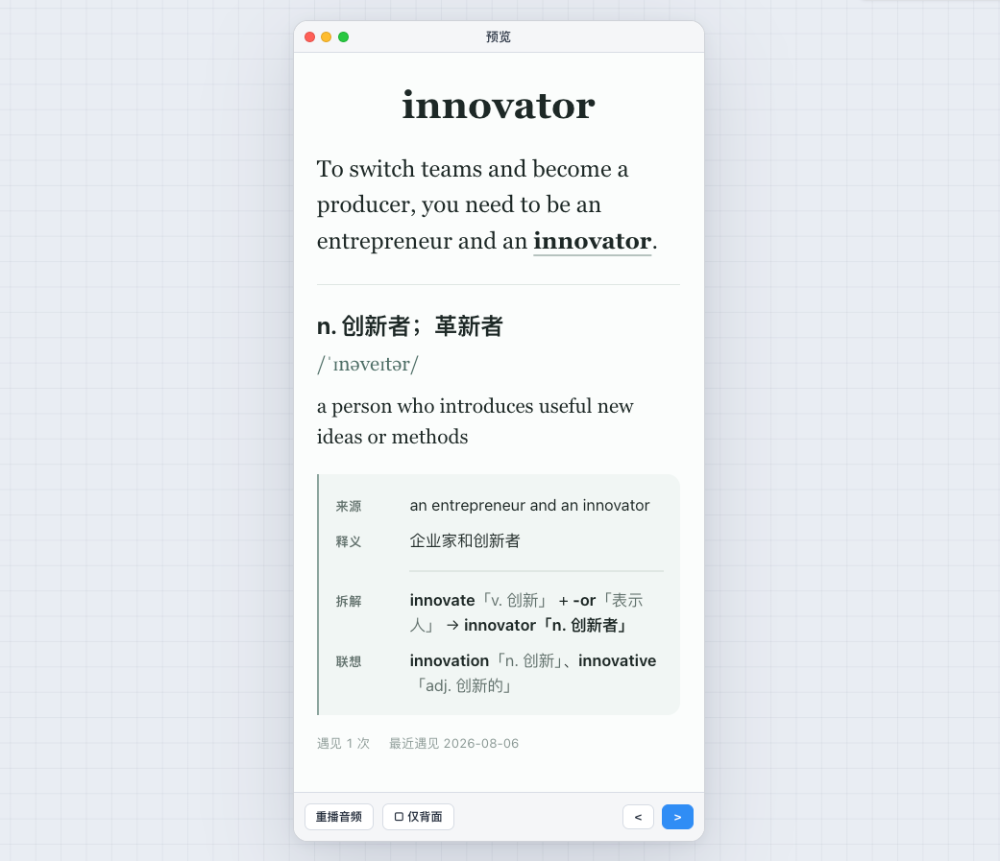

# eudic-to-anki

**English** | [中文](README.zh-CN.md)

An open-source [Agent Skill](https://agentskills.io/) that exports vocabulary encounters and reading context from Eudic, creates one-card Context Anchor notes, generates pronunciation audio, and imports them into Anki through AnkiConnect.

```text
Eudic → Agent-authored card → validation and Edge-TTS → Anki
```

<p align="center">
  
</p>

## Core features

- **Context-first cards**: the front shows only the word and its source, adapted, or generated sentence. Tapping the word plays pronunciation audio.
- **Structured back**: contextual Chinese meaning, IPA, English definition, optional source chunk, useful morphology clues, and encounter history appear in learning order without collapsed sections or classification markers.
- **Managed study groups**:
  - `learn`: high-transfer vocabulary for daily review
  - `defer`: useful but lower-priority vocabulary; a distinct later encounter promotes it to `learn`
  - `skip`: complete but low-value vocabulary kept in Anki for manual movement or deletion
  - `reject`: invalid fragments or garbage that never enter Anki
- **One note per term**: an identical encounter is idempotent. A distinct encounter updates the existing note and resets its single card to new.
- **Hard safety gates**: Edge-TTS retries once and then stops without a system TTS fallback. Anki templates are verified before import, and continuous date ranges use one protected export process.

## Requirements

- An Agent runtime that supports Agent Skills
- Node.js and `npx` for installation
- Python 3 and the `edge-tts` Python package
- A Eudic account and OpenAPI token
- Anki Desktop with the AnkiConnect add-on `2055492159`

Keep Anki Desktop open while importing.

## Install

```bash
npx skills add trvs-lab/eudic-to-anki-skills --skill eudic-to-anki -g -y
```

Codex users must also ask the Agent to read [`skills/eudic-to-anki/RULES_README.md`](skills/eudic-to-anki/RULES_README.md) and generate the local `~/.codex/rules/eudic-to-anki.rules` file.

## Quick start

1. Configure `EUDIC_TOKEN` and install AnkiConnect.
2. Open Anki Desktop.
3. Ask the Agent to run the environment check and import a word range.

Example prompts:

```text
Import yesterday's Eudic words into Anki.
```

```text
Import my Eudic words from the past week into Anki.
```

```text
Import my Eudic words from 2026-08-01 into Anki.
```

A continuous range such as “the past week” is exported once, not split into daily export jobs.

## Project documentation

- [Eudic OpenAPI token and export limits](skills/eudic-to-anki/references/openapi.md)
- [Anki, AnkiConnect, and TRVS-Lab model setup](skills/eudic-to-anki/references/anki.md)
- [Complete Agent workflow](skills/eudic-to-anki/SKILL.md)
- [Codex local rules](skills/eudic-to-anki/RULES_README.md)

The skill implementation lives under [`skills/eudic-to-anki/`](skills/eudic-to-anki/), including its assets, modules, references, scripts, and workflows.

## Official guides

- [Installation and initial setup](https://trvs.dev/blog/20260419-eudic-to-anki-skill/) (Chinese)
- [Latest card design and study workflow](https://trvs.dev/blog/20260812-eudic-anki-skill-redesign/) (Chinese)

## License

MIT. See [LICENSE](LICENSE).
