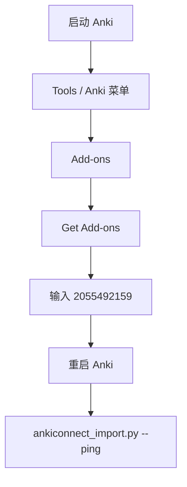

# eudic-to-anki

**Who reads this**

- **AI agent:** use **§ Agent quick reference** and then open **`SKILL.md`** as the procedural source of truth.
- **Human (setup only):** jump to **§ Human setup** for `EUDIC_TOKEN`, Anki, and AnkiConnect. You do not need to run shell commands by hand if an agent drives the workflow.

---

## Agent quick reference

### 安装（Vercel skills CLI）

本仓库符合 [Agent Skills](https://agentskills.io/) 与 [Vercel Agent Skills](https://vercel.com/docs/agent-resources/skills) 约定的 `skills/<skill-name>/` 布局。发布到 GitHub 后，他人可执行：

```bash
npx skills add <owner>/<repo> --skill eudic-to-anki
```

安装完成后，在 agent 里以 **本目录为 cwd**（包含 `SKILL.md` 的目录）运行文档中的命令。仓库总览见根目录 [README.md](../../README.md)。

### 目录结构

- `SKILL.md`：唯一主入口（agent-first）
- `modules/export/README.md`：欧路导出模块
- `modules/coach/README.md`：TRVS-Lab 内容与校验模块
- `modules/import/README.md`：Anki 导入模块
- `modules/audio/README.md`：发音模块
- `workflows/`：按场景的执行清单
- `scripts/`：统一命令入口（已内聚实现）
- `import_scratch/`：中间文件目录

### 常用命令

- 导入成功后 `ankiconnect_import.py` **默认**会调用 Anki 同步（AnkiConnect `sync`）；不需要同步时加 `--no-sync`。
- 环境检查：`bash scripts/check_env.sh`
- 列分类：`python3 scripts/eudic_export.py --list-categories`
- Anki 连通性：`python3 scripts/ankiconnect_import.py --ping`
- 音频试跑：`python3 scripts/edge_tts_runner.py --text "semantic" --output /tmp/semantic.mp3`
- 大批量 base64 解码：`python3 scripts/decode_subagent_transcript_b64.py <subagent.jsonl> -o import_scratch/coach_batch_01.json`

---

## Human setup

以下内容供**最终用户**或**维护者**配置环境；日常「把生词导入 Anki」仍建议由 agent 按 `SKILL.md` 执行。

### 配置 `EUDIC_TOKEN`（欧路 OpenAPI）

这与 **OpenAI API** 无关；是欧路词典云 API 的授权串。

1. 浏览器打开：[欧路 OpenAPI 授权页](https://my.eudic.net/OpenAPI/Authorization)。
2. 登录后复制页面上的 **authorization / token**（若已带 `NIS ` 前缀则整段复制）。
3. 在本机终端导出（示例；勿把真实 token 写进仓库）：

```bash
export EUDIC_TOKEN="NIS 你的-token"
```

4. 若只在 `~/.zshrc` 里配置了变量、而 Cursor/agent 子进程拿不到，可用本 skill 的包装器（在 **本 skill 目录** 下执行）：

```bash
python3 scripts/run_with_login_zsh.py python3 scripts/eudic_export.py --list-categories
```

更细的说明见 [`references/openapi.md`](references/openapi.md)。

#### 示意图（流程）


#### 示意图（可选截图）

若已在 [`docs/images/`](docs/images/) 放入截图，可取消注释下面一行：

<!--  -->

### 安装 AnkiConnect 插件

1. 安装并启动 [Anki Desktop](https://apps.ankiweb.net/)。
2. 菜单：**Tools**（Windows/Linux）或 **Anki**（macOS）→ **Add-ons** → **Get Add-ons…**。
3. 在弹窗中输入插件代码：**`2055492159`**（[AnkiConnect](https://ankiweb.net/shared/info/2055492159)）。
4. 安装后按提示**重启 Anki**。
5. 在本 skill 目录自检：

```bash
python3 scripts/ankiconnect_import.py --ping
```

正常时应看到 AnkiConnect 版本信息。更多说明见 [`references/anki.md`](references/anki.md)。

#### 示意图（菜单路径）



#### 示意图（可选截图）

维护者可将界面截图放入 [`docs/images/`](docs/images/)，例如：

<!--  -->
<!--  -->
